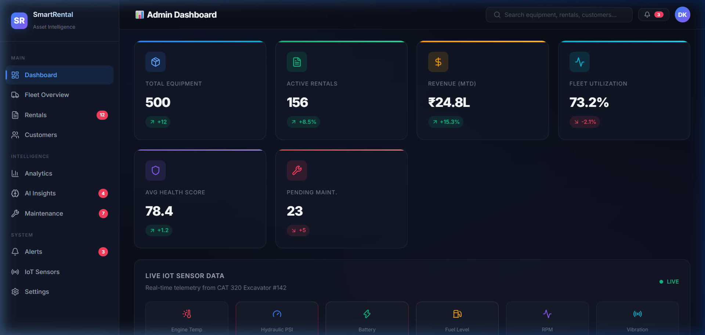
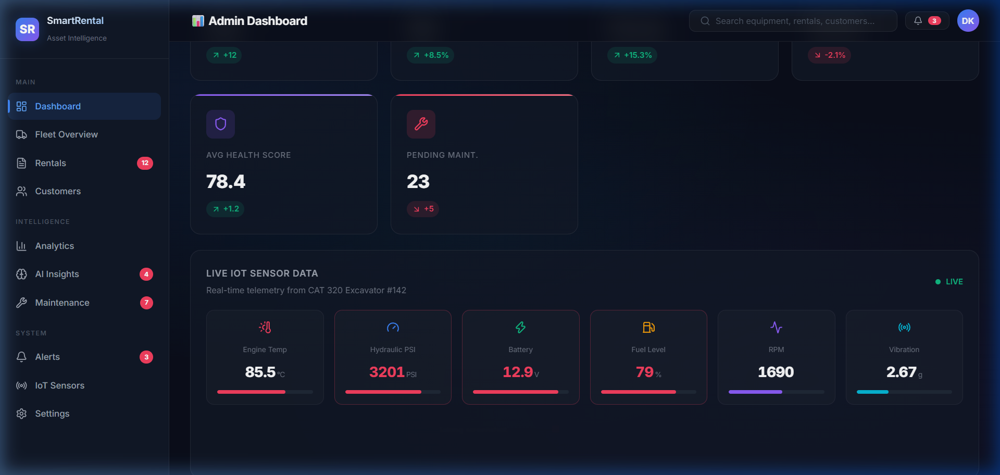

# 🏗️ Caterpillar Dealer Asset Management & Predictive Analytics Platform

An **AI-powered intelligent rental asset management system** that combines IoT telemetry ingestion, ML predictive analytics, dynamic pricing, and real-time interactive dashboards to optimize construction equipment rental operations.

---

## 📸 Dashboard Preview




*Explore full interaction visual showcases and recordings in [docs/walkthrough.md](docs/walkthrough.md).*

---

## ✨ Standout & Unique Features

This platform includes 8 unique, high-impact enterprise capabilities built specifically for heavy machinery dealers and contractors:

### 1. 🔍 360° AI Computer Vision Damage Detection
* **Automated Visual Inspection**: Compares 360° equipment images taken pre-rental and post-rental using AI computer vision.
* **Instant Damage Analysis**: Automatically flags new dents, scratches, paint abrasion, structural bends, or hydraulic leak points.
* **Cost & Dispute Reduction**: Automatically estimates repair costs, generates digital inspection certificates, and eliminates disputes between rental customers and equipment dealers.

### 2. 🎯 AI Sizing & Job-Fit Recommender
* **Intelligent Requirement Matching**: Customers input project requirements (job type, terrain, payload tons, digging depth, operating hours, budget).
* **Precision Equipment Sizing**: Recommends the exact right-sized machine (e.g., CAT 320 vs CAT 349 Excavator) based on historical job performance data and machine load limits.
* **Cost & Risk Optimization**: Prevents contractors from over-paying for unnecessarily large machines or risking job delays with under-powered equipment.

### 3. 🧠 Explainable AI (XAI) Recommendation Engine
* **Transparent Decision Reasoning**: Every AI recommendation includes human-readable reasoning points (e.g., *"Recommended because dig depth requirement of 6.0m matches 6.5m max limit, clay soil requires >=200HP, 96% health score"*).
* **Confidence & Productivity Meter**: Displays percentage confidence scores (0–100%) and estimated fuel efficiency (L/day) alongside productivity forecasts.

### 4. 💸 Multi-Factor Dynamic Pricing Engine
* **Automated Line-Item Rate Adjustments**: Calculates daily rates based on real-time factors: Base Equipment Rate × Regional Demand Multiplier × Asset Health Factor + Logistics/Transport + Insurance + Certified Operator Fees + 18% GST.
* **Instant Quotation Generation**: Generates official digital quotes in real-time with one-click customer acceptance.

### 5. 📡 Real-Time CAN-BUS IoT Telemetry & Anomaly Alerts
* **Live Machine Stream**: Ingests high-frequency IoT sensor telemetry (Engine Temp, Hydraulic PSI, Battery Voltage, Vibration, Fuel Level, Operating Hours, GPS).
* **Isolation Forest Anomaly Detection**: Detects operational anomalies (e.g., hydraulic pressure drops or engine overheating) before mechanical failure occurs.

### 6. 🛠️ Predictive Maintenance & Health Scoring
* **Days-to-Failure Prediction**: Calculates remaining useful life (RUL) and predicts component failures days in advance using Random Forest models.
* **Dynamic Health Index (0–100%)**: Aggregates engine, hydraulic, electrical, and structural health into a single live score.

### 7. 📈 30-Day AI Regional Demand Forecasting
* **Gradient Boosting Projections**: Predicts 30-day equipment demand across categories (Excavators, Loaders, Cranes, Bulldozers) and geographic regions.
* **Statistical Confidence Bounds**: Displays upper and lower confidence intervals for fleet allocation planning.

### 8. 🔐 Dual Portal Architecture & Lifecycle Order Tracking
* **Role-Based JWT Security**: Completely isolated **Admin Dashboard** (`/admin/*`) and **Customer Portal** (`/customer/*`).
* **End-to-End Tracking Stepper**: Tracks rental requests through 7 lifecycle stages (`Requested` ➔ `Quoted` ➔ `Confirmed` ➔ `Dispatched` ➔ `Active` ➔ `Returning` ➔ `Completed`).

### 9. 💳 Automated Enterprise FinTech & ERP Data Export
* **Seamless Financial Integration**: Seamlessly exports structured rental financial data (itemized invoices, tax ledgers, deposit receipts, dynamic pricing breakdowns, and payment settlements) into standard enterprise formats (JSON, CSV, QuickBooks, SAP ERP, Oracle Financials, Tally Prime).
* **Automated Accounting & Billing**: Streamlines dealer billing reconciliation and allows contractor accounting teams to ingest clean invoice line items directly into their corporate ERP and accounting software without manual data entry.

---

## 🚀 Quick Start

### Prerequisites
- Node.js 18+ and npm
- Python 3.10+
- Docker & Docker Compose (for full infrastructure stack)

### 1. Frontend Dashboard (Quick Demo)
```bash
cd frontend
npm install
npm run dev
```
Open http://localhost:5173 to interact with the dashboard.

### 2. Backend API
```bash
cd backend
pip install -r requirements.txt
uvicorn main:app --reload
```
Interactive API documentation available at http://localhost:8000/docs.

### 3. Synthetic Data Generation Pipeline
```bash
cd data/pipeline
python generate_synthetic_data.py
```

### 4. ML Model Training
```bash
cd backend
python -m app.ml.models
```

### 5. Full Infrastructure Stack (Docker)
```bash
docker-compose up -d
```

---

## 📁 Consolidated Project Structure

```
smart-rental-platform/
├── README.md                          # Main project overview & documentation index
├── docker-compose.yml                 # 12-service infrastructure setup
├── backend/                           # FastAPI Python Backend
│   ├── main.py                        # FastAPI entry point & CORS configuration
│   ├── requirements.txt               # Backend dependencies
│   └── app/
│       ├── api/routes/                # REST API endpoints (analytics, equipment, rentals)
│       ├── core/                      # App configuration & async DB session
│       ├── models/                    # 11 SQLAlchemy ORM models & 20+ Pydantic schemas
│       ├── ml/                        # 5 Core ML model implementations
│       └── services/                  # Business domain services
├── frontend/                          # React + Vite Dashboard
│   ├── package.json
│   ├── vite.config.js
│   └── src/
│       ├── App.jsx                    # Admin dashboard UI with 9 interactive panels
│       └── index.css                  # Dark-theme glassmorphism design system
├── data/                              # Synthetic Data Pipeline & CSV Datasets
│   ├── pipeline/
│   │   └── generate_synthetic_data.py # 10-entity synthetic data generator (120K+ records)
│   └── synthetic/                     # Generated CSV dataset directory
├── ml/                                # Serialized ML Model Artifacts & Training
│   ├── models/                        # Saved model binary artifacts (.pkl)
│   └── training/                      # Offline training & validation scripts
└── docs/                              # Integrated Project Documentation & Visual Assets
    ├── architecture/
    │   └── system_design.md           # Full system architecture blueprint & gap analysis
    ├── task_roadmap.md                # Task tracking & 5-phase project roadmap
    ├── walkthrough.md                 # Complete verification walkthrough with UI screenshots
    └── screenshots/                   # PNG screenshots & WebP demo interaction recordings
        ├── dashboard_top.png
        ├── dashboard_middle.png
        ├── dashboard_utilization_table.png
        ├── dashboard_bottom.png
        ├── dashboard_demo.webp
        └── dashboard_preview.webp
```

---

## 📚 Documentation Index

- 📐 **System Architecture & Design**: [docs/architecture/system_design.md](docs/architecture/system_design.md)
- 📌 **Task Checklist & Roadmap**: [docs/task_roadmap.md](docs/task_roadmap.md)
- 🎬 **UI Walkthrough & Screenshots**: [docs/walkthrough.md](docs/walkthrough.md)

---

## 🤖 AI/ML Engines

| Model Engine | Algorithm | Purpose |
|---|---|---|
| **Demand Forecasting** | Gradient Boosting | Predict 30-day rental demand by category/region |
| **Predictive Maintenance** | Random Forest | Predict equipment failure probability & days-to-failure |
| **Dynamic Pricing** | Gradient Boosting | Compute optimal rental rates based on demand & asset health |
| **Anomaly Detection** | Isolation Forest | Identify anomalous IoT sensor telemetry in real-time |
| **Job-Fit Recommender** | Rule + ML Hybrid | Recommend optimal machine class & tonnage for job specs |

---

## 📊 Core Dashboard Features

- **Real-Time KPI Monitoring**: Live tracking of fleet utilization, active rentals, total revenue, average health score, pending maintenance alerts, and active AI recommendations.
- **Live IoT Telemetry Panel**: Auto-refreshing sensor metrics (Engine Temp, Hydraulic Pressure, Vibration Level, GPS, Fuel Level, Operating Hours) with automated anomaly flags.
- **AI Analytics & Charts**: Interactive Recharts components visualizing revenue trends, forecasted demand with upper/lower confidence bounds, category distribution, and fleet health breakdown.
- **Fleet Utilization & Health Table**: Detailed asset status table featuring progress indicators and real-time health badges.
- **AI Recommendation Engine**: Actionable predictive prompts with one-click Approve/Reject workflow capabilities.
- **Severity-Coded Alert Feed**: Categorized system alerts (Critical, Warning, Info) with interactive hover states.

---

## 🛠️ Technology Stack

* **Backend Framework**: FastAPI, SQLAlchemy (Async), Pydantic v2
* **Databases & Cache**: PostgreSQL (Relational metadata), TimescaleDB (Time-series IoT), Redis (Caching & Sessions)
* **Data Ingestion & Streaming**: MQTT Broker (Eclipse Mosquitto), Apache Kafka, Apache Flink
* **Frontend UI**: React 18, Vite, Recharts, Lucide Icons, Vanilla CSS Design Tokens
* **Machine Learning**: scikit-learn, XGBoost, Prophet, pandas, NumPy
* **DevOps & Infrastructure**: Docker, Docker Compose, Elasticsearch, MinIO Object Storage
