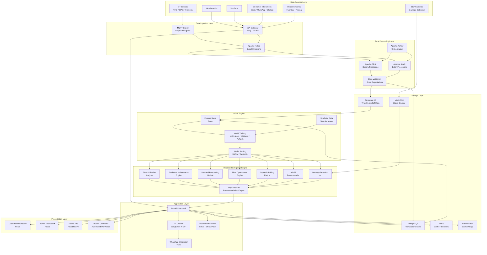
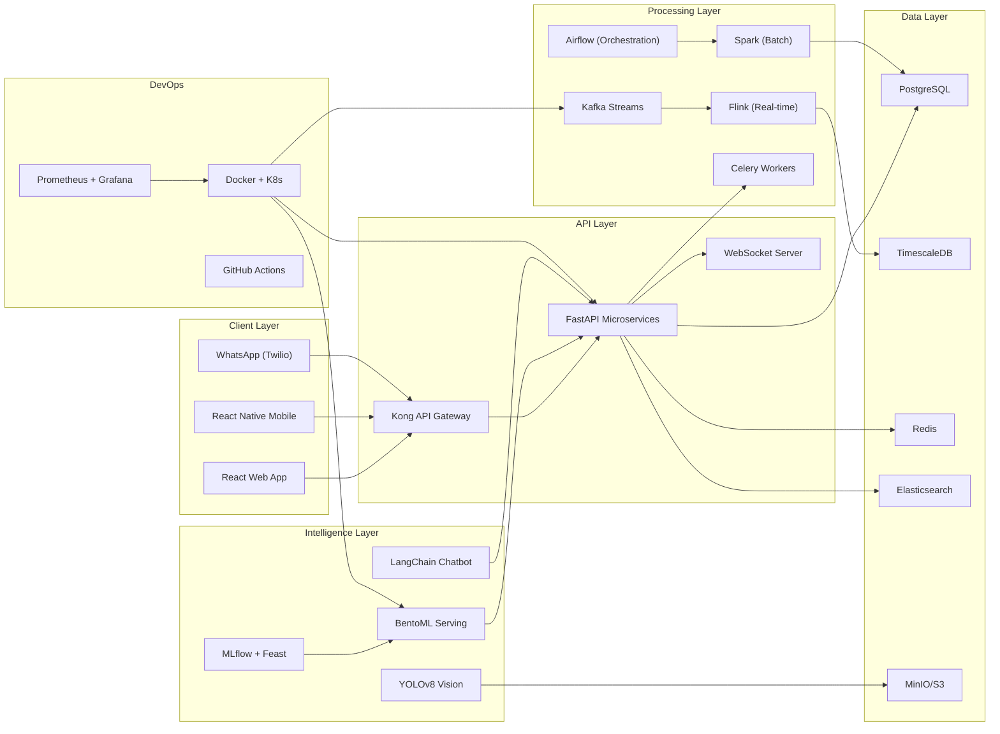
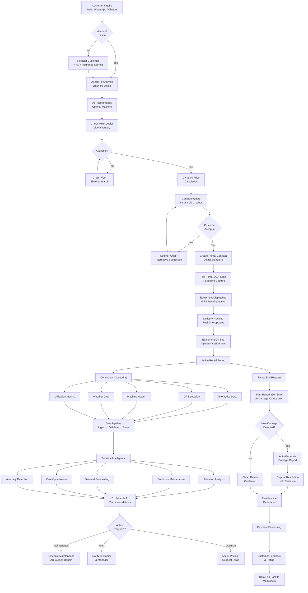
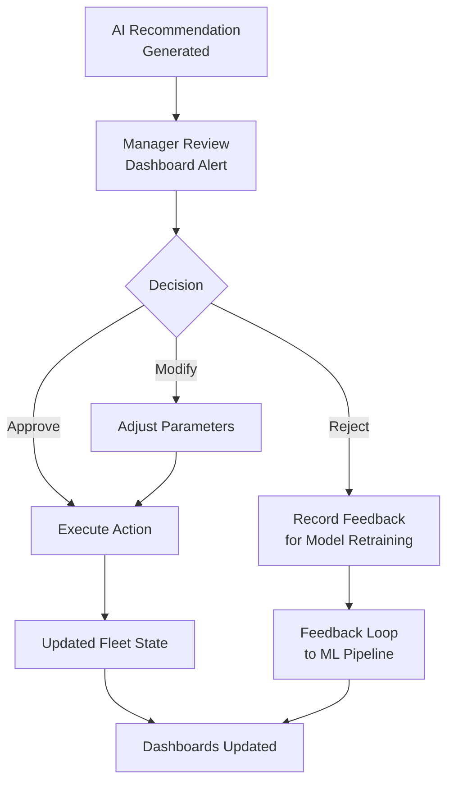
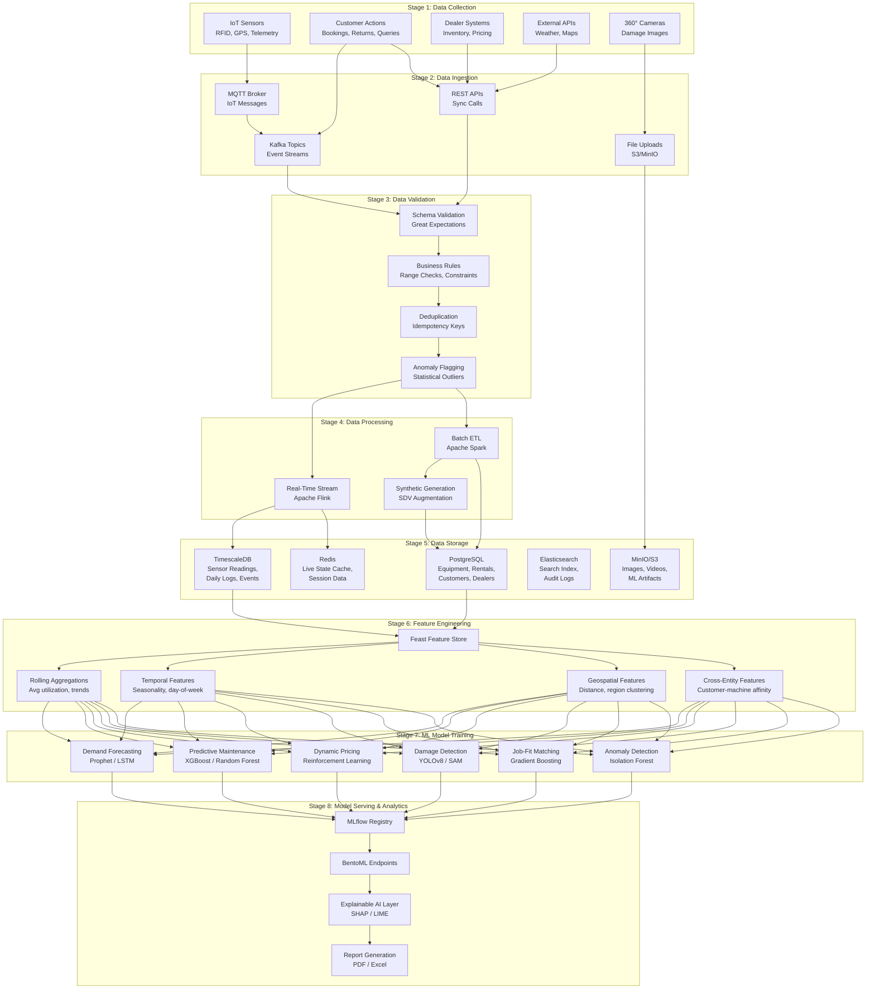
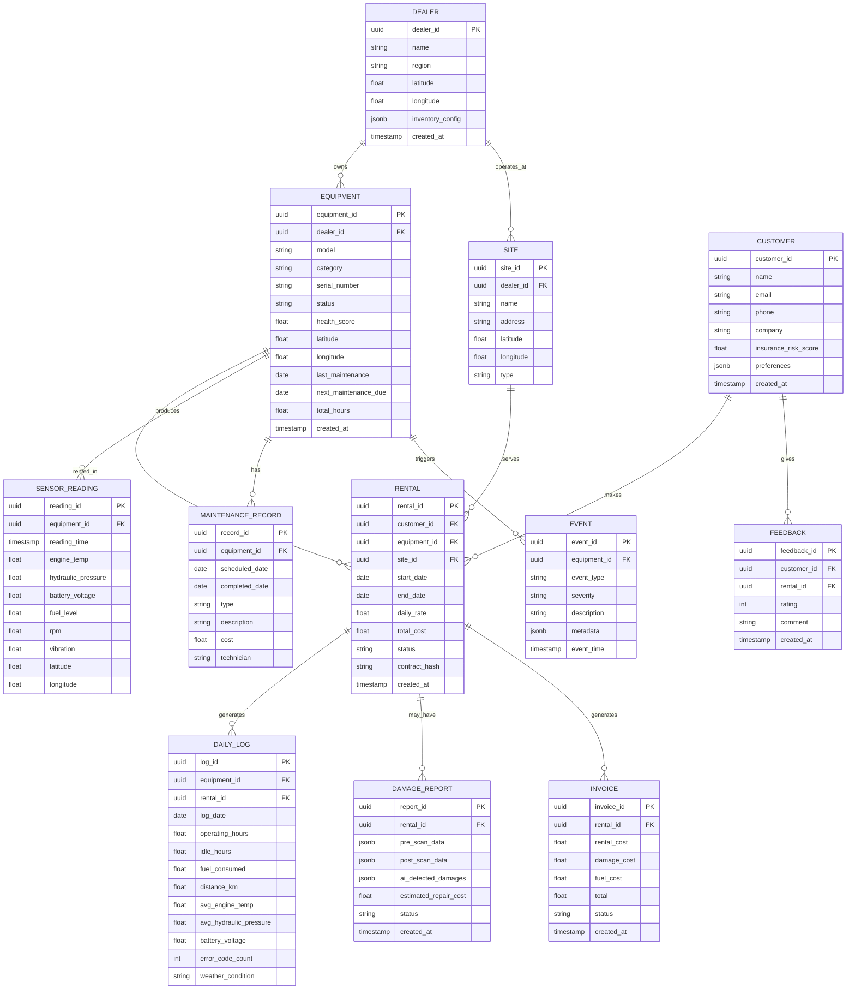
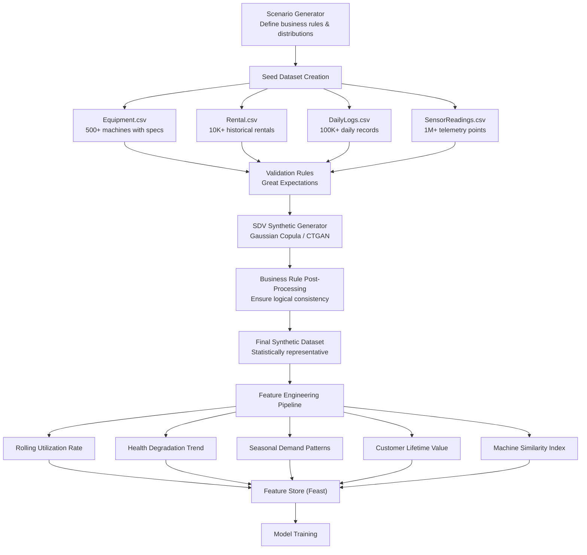
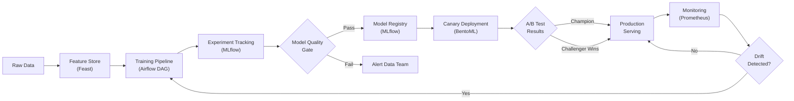
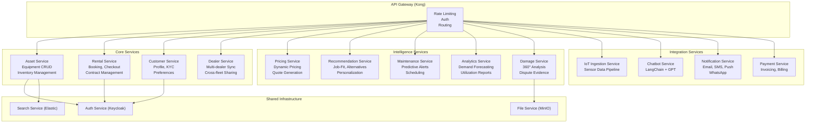
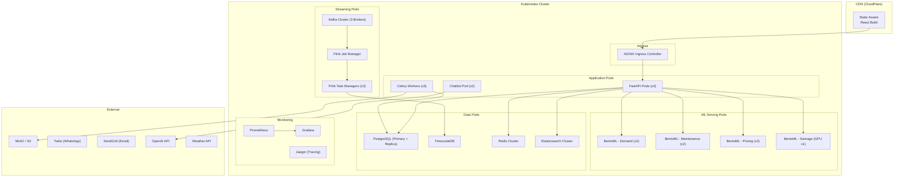

# AI-Powered Caterpillar Dealer Asset Management & Predictive Analytics System

## Implementation Plan — Complete System Design

This document presents the full architecture, tech stack, workflow, dataflow, system design, and unique differentiators for building an intelligent rental asset management platform that combines IoT, AI/ML, predictive analytics, dashboards, and messaging integration.

---

## 1. Problem Statement & Gap Analysis

### Current Industry Pain Points

| Pain Point | Current State | Proposed Solution |
|---|---|---|
| Inconsistent service & inventory | Dealers operate in silos, no unified view | **Unified Multi-Dealer Stock System** with live inventory sync across all nearby dealers |
| High damage fees & repair disputes | Manual inspection, subjective assessments | **AI-powered 360° damage detection** with before/after comparison + IoT sensor alerts |
| High rental costs & idle time | Static pricing, no utilization visibility | **Dynamic pricing engine** + real-time utilization dashboard (working vs idle hours) |
| Oversized machine rentals | No guidance, customers guess machine size | **AI Job-Fit Recommender** — enter job specs, get optimal machine recommendation |
| No predictive maintenance | Reactive repairs, costly downtime | **Predictive maintenance engine** using telemetry data + ML failure prediction |
| Poor customer experience | Phone calls, manual quotes, no tracking | **AI Chatbot** (Web + WhatsApp) for instant quotes, booking, and delivery tracking |

### Where the Industry is Lagging (Unique Opportunities)

> [!IMPORTANT]
> These are the **unique differentiators** that set this platform apart from existing solutions.

1. **Carbon Footprint Tracking** — Track emissions per rental/machine, generate ESG compliance reports
2. **Digital Twin Integration** — Virtual replicas of physical assets for simulation & predictive scenarios
3. **Operator Skill Matching** — Match machine complexity to operator certification/experience level
4. **Insurance Risk Scoring** — AI-generated risk scores per rental for dynamic insurance pricing
5. **Cross-Fleet Sharing Marketplace** — Allow dealers to share underutilized assets across networks
6. **Geofencing & Theft Prevention** — Real-time boundary alerts with automatic engine lockdown
7. **Voice-Enabled Field Reporting** — Operators report issues via voice, transcribed by AI
8. **Augmented Reality Maintenance** — AR overlays for field technicians during repairs
9. **Blockchain Rental Contracts** — Immutable rental agreements and dispute resolution
10. **Weather-Aware Scheduling** — Automatically reschedule outdoor jobs based on weather forecasts

---

## 2. Unified System Architecture

---

## 3. Recommended Tech Stack

### 3.1 Core Tech Stack Table

| Layer | Technology | Purpose | Why This Choice |
|---|---|---|---|
| **Frontend** | React 18 + TypeScript | Customer & Admin Dashboards | Component-based, huge ecosystem, TypeScript safety |
| **Frontend** | Recharts / D3.js | Data Visualization | Rich chart library for analytics dashboards |
| **Frontend** | Mapbox GL / Leaflet | Geospatial Maps | Live GPS tracking, geofencing, site maps |
| **Mobile** | React Native | Cross-platform Mobile App | Shared codebase with web, 360° camera integration |
| **Backend** | FastAPI (Python) | REST API + WebSocket | Async, auto-docs, ML-friendly, high performance |
| **Backend** | Celery + Redis | Task Queue | Background jobs: reports, ML inference, notifications |
| **API Gateway** | Kong / NGINX | Rate limiting, auth, routing | Production-grade API management |
| **Auth** | Keycloak / Auth0 | Identity & Access Management | SSO, RBAC, OAuth2, JWT |
| **Database** | PostgreSQL 16 | Transactional/Relational Data | Equipments, rentals, customers, dealers, invoices |
| **Database** | TimescaleDB | Time-Series Data | IoT sensor readings, telemetry, machine health |
| **Cache** | Redis 7 | Sessions, caching, pub/sub | Low-latency reads, real-time updates |
| **Search** | Elasticsearch 8 | Full-text search, log analytics | Asset search, audit logs, anomaly log querying |
| **Object Storage** | MinIO / AWS S3 | Binary storage | 360° images/videos, documents, ML model artifacts |
| **Messaging** | Apache Kafka | Event streaming | High-throughput IoT data ingestion, event sourcing |
| **IoT Protocol** | MQTT (Mosquitto) | Device communication | Lightweight, pub/sub for IoT sensors |
| **Stream Processing** | Apache Flink | Real-time analytics | Low-latency processing of sensor streams |
| **Batch Processing** | Apache Spark | Historical analytics | Large-scale data processing, ETL |
| **Orchestration** | Apache Airflow | Pipeline scheduling | DAG-based workflow for ML pipelines & ETL |
| **ML Framework** | scikit-learn, XGBoost, PyTorch | Model training | Demand forecasting, predictive maintenance, anomaly detection |
| **ML Ops** | MLflow | Experiment tracking, model registry | Model versioning, A/B testing, deployment |
| **Model Serving** | BentoML / TorchServe | Model deployment | REST/gRPC model APIs, batch inference |
| **Feature Store** | Feast | Feature management | Consistent features across training & serving |
| **Synthetic Data** | SDV (Synthetic Data Vault) | Data augmentation | Generate realistic synthetic rental/IoT data |
| **Computer Vision** | YOLOv8 / SAM | Damage detection | 360° image analysis, scratch/dent detection |
| **NLP / Chatbot** | LangChain + OpenAI GPT-4 | AI Chatbot | Conversational AI for booking, queries, recommendations |
| **WhatsApp** | Twilio API | Messaging integration | WhatsApp Business API for customer communication |
| **Notifications** | Firebase Cloud Messaging + SendGrid | Push/Email/SMS | Multi-channel notification delivery |
| **Data Validation** | Great Expectations | Data quality | Automated data quality checks in pipelines |
| **Monitoring** | Prometheus + Grafana | System monitoring | Infrastructure metrics, alerting, dashboards |
| **Logging** | ELK Stack | Centralized logging | Structured log aggregation and analysis |
| **Containerization** | Docker + Kubernetes | Deployment | Microservice orchestration, auto-scaling |
| **CI/CD** | GitHub Actions + ArgoCD | Deployment pipeline | Automated testing, builds, deployments |
| **Infrastructure** | Terraform | IaC | Reproducible infrastructure provisioning |

### 3.2 Tech Stack Architecture Diagram

---

## 4. Complete Workflow

### 4.1 Rental Lifecycle Workflow

### 4.2 Manager Decision Workflow

---

## 5. Complete Data Flow

### 5.1 Data Pipeline Architecture

### 5.2 Database Schema (Entity Relationship)

---

## 6. Synthetic Data Generation Pipeline

---

## 7. AI/ML Models Deep Dive

### 7.1 Model Catalog

| Model | Algorithm | Input Features | Output | Update Frequency |
|---|---|---|---|---|
| **Demand Forecasting** | Prophet + LSTM Ensemble | Historical rentals, seasonality, weather, events | Daily demand per machine category per region | Weekly retrain |
| **Predictive Maintenance** | XGBoost + Survival Analysis | Engine temp, vibration, hours, maintenance history | Days-to-failure probability, maintenance priority | Daily inference |
| **Dynamic Pricing** | Contextual Bandits (RL) | Demand, supply, competitor prices, customer segment | Optimal daily rental rate | Real-time |
| **Job-Fit Recommender** | Gradient Boosted Trees | Job type, soil condition, area, depth, duration | Top-3 machine recommendations with confidence | On-demand |
| **Damage Detection** | YOLOv8 + Segment Anything | Before/after 360° images | Damage bounding boxes, severity, repair cost estimate | On-demand |
| **Anomaly Detection** | Isolation Forest + Autoencoders | Sensor readings, operational parameters | Anomaly score, affected components | Real-time streaming |
| **Customer Churn** | Logistic Regression + Random Forest | Rental frequency, satisfaction, pricing sensitivity | Churn probability, retention recommendations | Monthly |
| **Fleet Optimization** | Mixed-Integer Programming | Machine locations, demand forecasts, costs | Optimal fleet distribution plan | Daily |

### 7.2 ML Pipeline Workflow

---

## 8. Dashboard Designs

### 8.1 Customer Dashboard Features

| Section | Features |
|---|---|
| **My Rentals** | Active rentals, history, upcoming returns, delivery tracking map |
| **Asset Browser** | Search/filter available equipment, live stock across dealers, instant quotes |
| **AI Recommendations** | Job-fit suggestions, similar machines, price alerts |
| **Machine Status** | Live GPS location, utilization chart (work vs idle), health indicator |
| **Invoices & Payments** | Current charges, payment history, dispute resolution |
| **Damage Reports** | 360° scan comparisons, AI-detected damages, repair estimates |
| **Carbon Footprint** | Emissions per rental, sustainability score |

### 8.2 Admin Dashboard Features

| Section | Features |
|---|---|
| **Fleet Overview** | Map view of all assets, status distribution, health heatmap |
| **Utilization Analytics** | Working hours vs idle hours, revenue per machine, top/bottom performers |
| **Demand Forecasting** | Predicted demand curves, recommended inventory adjustments |
| **Maintenance Calendar** | Scheduled & predicted maintenance, technician assignment |
| **Customer Analytics** | LTV scores, churn risk, satisfaction trends |
| **Dynamic Pricing** | Current pricing vs optimal pricing, revenue impact simulation |
| **Financial Reports** | Revenue, cost, margin by dealer/region/category |
| **Anomaly Alerts** | Real-time sensor anomalies, geofence violations, overdue rentals |
| **AI Recommendations Log** | All AI suggestions, approval rate, outcome tracking |

---

## 9. Microservices Architecture

---

## 10. Deployment Architecture

---

## 11. Phased Implementation Plan

### Phase 1: Foundation (Weeks 1–4)

| Task | Details | Deliverable |
|---|---|---|
| Project Setup | Monorepo, CI/CD, Docker Compose for local dev | Dev environment |
| Database Design | PostgreSQL + TimescaleDB schemas, migrations | Database ready |
| Auth System | Keycloak/Auth0 integration, RBAC | Login/Register |
| Core APIs | Equipment CRUD, Customer CRUD, Rental CRUD | REST endpoints |
| Basic Frontend | React app scaffold, routing, auth pages | App shell |

### Phase 2: Core Rental System (Weeks 5–8)

| Task | Details | Deliverable |
|---|---|---|
| Rental Workflow | Booking, checkout, return flow | End-to-end rental |
| Multi-Dealer Inventory | Live stock sync across dealers | Unified inventory |
| Customer Dashboard | Available assets, booking status, rental history | Customer portal |
| Admin Dashboard | Asset management, customer management, rentals | Admin portal |
| Notification Service | Email + push notifications | Alert system |

### Phase 3: IoT & Data Pipeline (Weeks 9–12)

| Task | Details | Deliverable |
|---|---|---|
| MQTT + Kafka Setup | IoT ingestion pipeline | Data collection |
| Flink Stream Processing | Real-time sensor data processing | Live telemetry |
| Synthetic Data Generator | SDV-based data augmentation | Training datasets |
| Feature Engineering | Feast feature store setup | Feature pipeline |
| Data Validation | Great Expectations integration | Data quality |

### Phase 4: AI/ML Engine (Weeks 13–18)

| Task | Details | Deliverable |
|---|---|---|
| Demand Forecasting | Prophet + LSTM model | Demand predictions |
| Predictive Maintenance | XGBoost failure prediction | Maintenance alerts |
| Dynamic Pricing | Contextual bandits pricing engine | Price optimization |
| Job-Fit Recommender | Machine-to-job matching model | Smart recommendations |
| MLflow Pipeline | Experiment tracking, model registry | ML Ops |
| BentoML Serving | Model deployment endpoints | Production ML APIs |

### Phase 5: Advanced Features (Weeks 19–24)

| Task | Details | Deliverable |
|---|---|---|
| AI Chatbot | LangChain + GPT integration | Conversational AI |
| WhatsApp Integration | Twilio WhatsApp Business API | WhatsApp booking |
| 360° Damage Detection | YOLOv8 image analysis | Automated damage reports |
| Anomaly Detection | Real-time sensor anomalies | Alert system |
| Geofencing | GPS boundary monitoring | Theft prevention |
| Carbon Tracking | Emissions calculation per rental | ESG reports |

### Phase 6: Polish & Scale (Weeks 25–30)

| Task | Details | Deliverable |
|---|---|---|
| Advanced Dashboards | D3.js visualizations, maps, heatmaps | Analytics suite |
| Report Generator | Automated PDF/Excel reports | Business reports |
| Cross-Fleet Marketplace | Asset sharing between dealers | Marketplace |
| Kubernetes Deployment | Production cluster, auto-scaling | Production deploy |
| Load Testing | k6/Locust performance testing | Performance validated |
| Security Audit | Pen testing, OWASP compliance | Security certified |

---

## 12. Estimated Resource Requirements

| Role | Count | Duration |
|---|---|---|
| Tech Lead / Architect | 1 | Full project |
| Backend Engineers (Python) | 2-3 | Full project |
| Frontend Engineers (React) | 1-2 | Full project |
| ML Engineer | 1-2 | Phase 3 onwards |
| Data Engineer | 1 | Phase 3 onwards |
| DevOps Engineer | 1 | Full project |
| UI/UX Designer | 1 | Phase 1-2, Phase 5-6 |
| QA Engineer | 1 | Phase 2 onwards |

---

## 13. Verification Plan

### Automated Tests
- **Unit Tests**: pytest for all backend services (>80% coverage)
- **Integration Tests**: API endpoint testing with test databases
- **ML Model Tests**: Model performance benchmarks (MAE, RMSE, F1 thresholds)
- **Load Tests**: k6 scripts simulating 1000+ concurrent users
- **Data Pipeline Tests**: Great Expectations suites for data quality

### Manual Verification
- End-to-end rental workflow testing
- Dashboard UI review with stakeholders
- AI chatbot conversation quality evaluation
- 360° damage detection accuracy review
- Cross-browser and mobile responsiveness testing
- Security penetration testing

---

## User Review Required

> [!IMPORTANT]
> **Scope Decision**: This is a large-scale enterprise system. Please confirm whether you want to:
> 1. **Build the full system** as described (6+ months, team effort)
> 2. **Build an MVP/Proof of Concept** focusing on core rental + basic AI (8-12 weeks, smaller scope)
> 3. **Build a specific module** (e.g., just the data pipeline + ML, or just the dashboards)

> [!IMPORTANT]
> **Deployment Target**: Where will this be deployed?
> - Cloud (AWS / GCP / Azure) — which provider?
> - On-premise
> - Hybrid

## Open Questions

> [!WARNING]
> 1. **Domain Focus**: Is this primarily for **construction equipment** (Cat dealers mentioned) or should it be more generic for any rental asset type?
> 2. **Data Availability**: Do you have any existing rental/IoT data, or should we start entirely with synthetic data?
> 3. **Budget for External Services**: Are paid APIs (OpenAI GPT-4, Twilio, cloud hosting) acceptable, or should we use only open-source alternatives?
> 4. **WhatsApp Business**: Do you have a WhatsApp Business account or should we plan for the approval process?
> 5. **IoT Hardware**: Do you have existing IoT sensors/devices, or is this purely simulated for now?
> 6. **Team Size**: How many developers will be working on this? This impacts whether we go monolith-first or microservices from day one.
