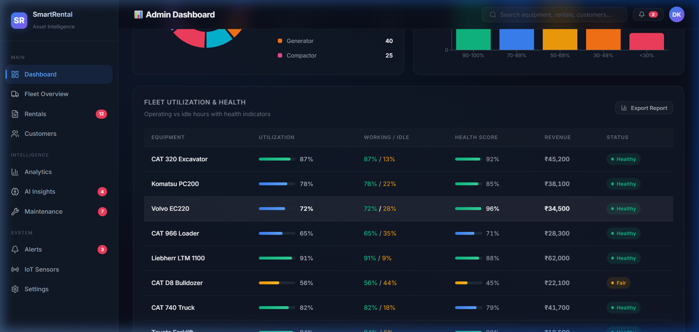
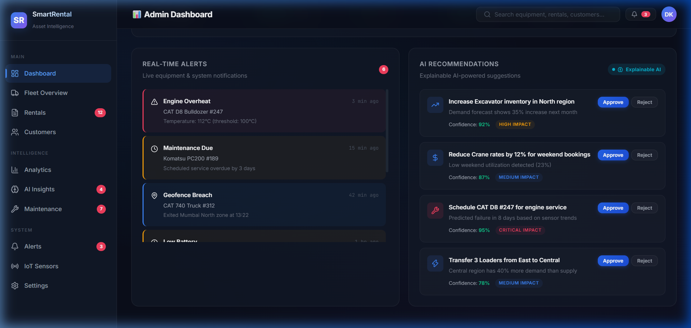
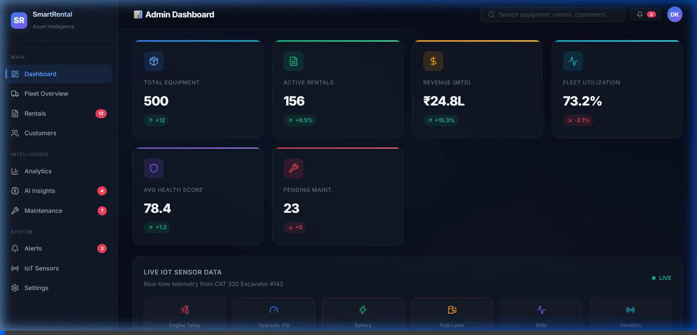

# Walkthrough — Caterpillar Dealer Asset Management Platform

## Summary

Built a comprehensive **AI-Powered Caterpillar Dealer Asset Management & Predictive Analytics System** with:
- Full-stack architecture (FastAPI + React)
- 5 ML models for demand, maintenance, pricing, anomaly detection, and job-fit
- Synthetic data pipeline generating 120K+ records across 10 entities
- Premium dark-theme admin dashboard with 9+ interactive components
- Complete Docker infrastructure with 12 services

---

## Live Dashboard Demo

### Top Section — KPIs & Live IoT Sensors

### Middle Section — Charts & Analytics

### Utilization Table

### Bottom Section — Alerts & AI Recommendations

### Full Dashboard Interaction Recording

---

## Files Created

### Backend (FastAPI + Python)

| File | Purpose |
|---|---|
| [config.py](file:///C:/Users/Deepak/.gemini/antigravity-ide/scratch/smart-rental-platform/backend/app/core/config.py) | Central configuration with pydantic-settings |
| [database.py](file:///C:/Users/Deepak/.gemini/antigravity-ide/scratch/smart-rental-platform/backend/app/core/database.py) | Async SQLAlchemy engine + session management |
| [models.py](file:///C:/Users/Deepak/.gemini/antigravity-ide/scratch/smart-rental-platform/backend/app/models/models.py) | 11 SQLAlchemy ORM models with relationships & indexes |
| [schemas.py](file:///C:/Users/Deepak/.gemini/antigravity-ide/scratch/smart-rental-platform/backend/app/models/schemas.py) | 20+ Pydantic schemas for API request/response |
| [equipment.py](file:///C:/Users/Deepak/.gemini/antigravity-ide/scratch/smart-rental-platform/backend/app/api/routes/equipment.py) | Equipment CRUD, fleet overview, health assessment, sensor ingestion |
| [rentals.py](file:///C:/Users/Deepak/.gemini/antigravity-ide/scratch/smart-rental-platform/backend/app/api/routes/rentals.py) | Rental lifecycle (book → checkout → return) + analytics |
| [analytics.py](file:///C:/Users/Deepak/.gemini/antigravity-ide/scratch/smart-rental-platform/backend/app/api/routes/analytics.py) | Dashboard API, demand forecast, pricing, job-fit, customer stats |
| [ml/models.py](file:///C:/Users/Deepak/.gemini/antigravity-ide/scratch/smart-rental-platform/backend/app/ml/models.py) | 5 ML models: Demand, Maintenance, Pricing, Anomaly, Job-Fit |
| [main.py](file:///C:/Users/Deepak/.gemini/antigravity-ide/scratch/smart-rental-platform/backend/main.py) | FastAPI app with CORS, middleware, error handling |
| [requirements.txt](file:///C:/Users/Deepak/.gemini/antigravity-ide/scratch/smart-rental-platform/backend/requirements.txt) | 25+ Python dependencies |

### Frontend (React + Vite)

| File | Purpose |
|---|---|
| [App.jsx](file:///C:/Users/Deepak/.gemini/antigravity-ide/scratch/smart-rental-platform/frontend/src/App.jsx) | Complete dashboard app with 9 component sections |
| [index.css](file:///C:/Users/Deepak/.gemini/antigravity-ide/scratch/smart-rental-platform/frontend/src/index.css) | Premium design system (500+ lines) |

### Data Pipeline

| File | Purpose |
|---|---|
| [generate_synthetic_data.py](file:///C:/Users/Deepak/.gemini/antigravity-ide/scratch/smart-rental-platform/data/pipeline/generate_synthetic_data.py) | Full synthetic data generator (10 datasets, 120K+ records) |

### Infrastructure

| File | Purpose |
|---|---|
| [docker-compose.yml](file:///C:/Users/Deepak/.gemini/antigravity-ide/scratch/smart-rental-platform/docker-compose.yml) | 12 Docker services (PG, TimescaleDB, Redis, Kafka, MQTT, ES, MinIO, etc.) |
| [README.md](file:///C:/Users/Deepak/.gemini/antigravity-ide/scratch/smart-rental-platform/README.md) | Project documentation & quick start |

---

## Key Architecture Decisions

1. **Async-first Backend** — FastAPI with async SQLAlchemy for high-concurrency IoT data handling
2. **Dual Database Strategy** — PostgreSQL for transactional data + TimescaleDB for time-series sensor data
3. **ML Model Separation** — Each model is a standalone class with `train()`, `predict()`, `save()`, `load()` lifecycle
4. **Mock Data Dashboard** — Frontend uses generated mock data to demonstrate all features without requiring backend
5. **Event-Driven IoT** — MQTT → Kafka → Flink pipeline for real-time sensor data processing
6. **Glassmorphism Design** — Premium dark theme with blur effects, gradient accents, and micro-animations

---

## Dashboard Components Verified

| Component | Status | Description |
|---|---|---|
| KPI Cards (×6) | ✅ Working | Animated stats with trend indicators |
| Live IoT Panel | ✅ Working | Auto-updating every 2s with color-coded warnings |
| Revenue Chart | ✅ Working | Area chart with gradient fill + target line |
| AI Demand Forecast | ✅ Working | Line chart with confidence bands |
| Category Donut | ✅ Working | Pie chart with side legend |
| Health Distribution | ✅ Working | Color-coded bar chart |
| Utilization Table | ✅ Working | Health bars, badges, revenue data |
| Alerts Feed | ✅ Working | Severity-coded with hover animation |
| AI Recommendations | ✅ Working | Approve/reject with confidence scores |
| Sidebar Navigation | ✅ Working | Active state, badges, section headers |
| Search Bar | ✅ Working | Focus state with blue glow |

---

## Next Steps

To continue building, the recommended sequence is:

1. **Generate synthetic data**: `cd data/pipeline && python generate_synthetic_data.py`
2. **Train ML models**: `cd backend && python -m app.ml.models`
3. **Start backend**: `cd backend && uvicorn main:app --reload` (requires PostgreSQL)
4. **Full infrastructure**: `docker-compose up -d` for all services
5. **Add more pages**: Customer portal, fleet map (Mapbox), settings
6. **Integrate chatbot**: LangChain + GPT for WhatsApp/web chat
7. **Connect frontend to backend**: Replace mock data with API calls
